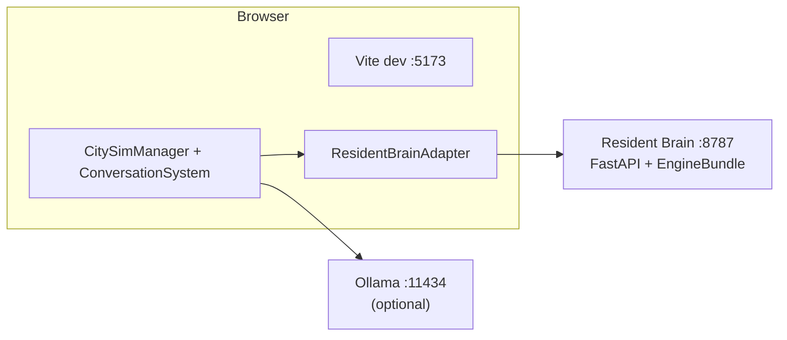

# AI City

**Repository:** [github.com/seed0001/AI-City](https://github.com/seed0001/AI-City)

AI City is a **3D simulated town** in the browser, populated by characters whose **decisions, emotions, memories, and conversations** are driven by a separate **Python service** that hosts roughly **100 cognition modules** (“engines”). The browser handles the **world and bodies**; the Python service handles their **minds**.

The interesting part is not the visuals. The interesting part is that residents are **not** hand-written behavior trees, scripted quests, or a single chat model “playing” them. They are driven by a **long-running, stateful, modular cognition layer** that imitates the structure of a mind: needs, drives, emotions, personality, memory, goals, intent, reflection, social ties, episodic recall.

For the full narrative (assumes no prior knowledge of the codebase), read **[`docs/01_project_vision.md`](docs/01_project_vision.md)**. This README keeps that spirit and adds setup and operations.

---

## Table of contents

1. [What this system is](#what-this-system-is)
2. [The space between two bad answers](#the-space-between-two-bad-answers)
3. [Living world and persistence](#living-world-and-persistence)
4. [Engine-driven minds](#engine-driven-minds)
5. [Lineage](#lineage)
6. [How this differs from a normal game or a chatbot](#how-this-differs-from-a-normal-game-or-a-chatbot)
7. [What it amounts to today](#what-it-amounts-to-today)
8. [Quick start](#quick-start)
9. [Features at a glance](#features-at-a-glance)
10. [Architecture snapshot](#architecture-snapshot)
11. [Tech stack](#tech-stack)
12. [npm scripts](#npm-scripts)
13. [Environment variables](#environment-variables)
14. [Ollama (LLM dialogue)](#ollama-llm-dialogue)
15. [Using the app](#using-the-app)
16. [AI and voice settings](#ai-and-voice-settings)
17. [Browser storage](#browser-storage)
18. [Simulation and documentation map](#simulation-and-documentation-map)
19. [Project structure](#project-structure)
20. [Key data flows](#key-data-flows)
21. [Production build](#production-build)
22. [Troubleshooting](#troubleshooting)
23. [License](#license)

---

## What this system is

Three layers run at the same time:

1. **Browser application** — React + Three.js: the town, movement, avatars, speech audio, UI.
2. **Simulation layer** — TypeScript, in-process: who exists, where they are, what they are doing, who is talking, memory, daily plans, relationships.
3. **Resident Brain Service** — Python (FastAPI), beside the browser (same machine or LAN): for each resident, a **private bundle** of cognition engines, exposed over HTTP so the sim can ask for decisions, conversation context, and record events.

When you open the page you see a small town. Characters walk, idle, and talk to each other or to your character. You move as a resident; NPC lines can use **text-to-speech**. The world keeps ticking while you watch.

---

## The space between two bad answers

The usual options for “intelligent characters” fail in opposite directions:

- **Game NPCs** — Few states, canned lines, triggers. They rarely **change** or **remember** in any deep sense.
- **Chatbots** — Convincing text on demand, but **no body**, **no place**, **no ongoing life**, and **no durable memory** across sessions in the way a town implies.

AI City tries to sit **between** those: characters who **live in a place**, carry **continuous inner state**, **make their own decisions**, **speak from that state**, and **change over time** as they accumulate history. That is the simplest sense of a **living world**: it keeps existing and changing even when no one is watching.

Concretely, the simulation decays energy and hunger, keeps a **daily plan** per resident, tracks **town days lived** and **life adaptation**, and writes encounters and conversations into a **layered memory** (short-term, episodic, long-term). This is not a universe simulation — it is a **small town’s social and emotional pulse** at an abstraction that can run in real time.

---

## Living world and persistence

**Layout persistence** — Placed markers (homes, parks, paths) live in **browser local storage**. Reload the page: the same town comes back; NPCs respawn from the saved layout.

**Mind persistence** — With the brain service running, each resident’s engine state is kept on disk under `server/residentBrain/state/engines/<entityId>/` (generated at runtime; not committed to git). After a restart, bundles **reload** and resume — emotion, events, intent backlog, and so on.

That is different from “save/load checkpoints”: state is the **byproduct of engines running**, not a snapshot you only take when convenient.

---

## Engine-driven minds

The cognition layer is **not** one big neural net. It is a **library of many small engines** — emotion, personality, memory, cognition, behavior, utility — each with a focused role. For every resident the service builds a **bundle**, runs phased ticks, and **synthesizes** decisions and **conversation context** from weighted contributions (typed adapters plus a capability registry and generic dispatch). When **Ollama** is present, it acts mainly as the **speech surface** that turns structured context into lines; the **shape** of the mind comes from the engines and the sim.

The engine library itself is **not vendored in this repo** (it is a separate Git project). Clone it into a folder named `Engines` at the project root, or point `ENGINES_ROOT` at a sibling checkout — see **[`ENGINE_INTEGRATION_README.md`](ENGINE_INTEGRATION_README.md)**.

---

## Lineage

Residents can **create children** (`createChildResident`): traits blend from parents, naming and home marker derive from the family, and the brain service exposes **`/brains/child`** to seed the child’s bundle. The child’s mind then **evolves on its own**. Full inheritance of episodic memory and long-arc personality is **not** the current goal; see **[`docs/08_lineage_system.md`](docs/08_lineage_system.md)** for what exists and what would come next.

---

## How this differs from a normal game or a chatbot

**Versus a scripted game** — There is no hand-authored quest tree or dialogue tree. What looks like “behavior” is **emergent** from layout, roster, simulation tick, and cognition (or **fallback heuristics** when the brain service is offline). That trades predictability for **aliveness**: no guaranteed plot, no single win condition.

**Versus a chatbot** — Residents have **position, action, location, destination, daily plan**. Their **mood, hunger, relationships, and memory** evolve **outside** chat. Speech is one expression of that state, not the source of it.

---

## What it amounts to today

AI City is **not** trying to be a finished product. It is a **substrate** for the question: *can a town feel alive enough that residents’ moods, memories, and relationships feel like theirs?*

The honest answer: **partially**, and the **infrastructure** is real — brain bundles, event feedback, multi-turn **conversation sessions** (topic, goals, turn budgets, arc memory), and broad **engine influence** on decisions and context. The remaining gaps (player↔NPC multi-turn, richer payloads into the brain, lineage depth, polish) are tracked in **[`docs/09_problems_and_next_steps.md`](docs/09_problems_and_next_steps.md)**. **[`docs/10_engine_influence_expansion.md`](docs/10_engine_influence_expansion.md)** records the engine-wiring expansion; **[`docs/11_conversation_sessions.md`](docs/11_conversation_sessions.md)** records the conversation-session work.

---

## Quick start

**Requirements**

- **Node.js** 18+
- **Python** 3.11+ with `pip` (for the Resident Brain Service)
- **Optional:** **Ollama** for LLM dialogue ([ollama.com](https://ollama.com/) — pull a model, e.g. `ollama pull llama3.2`)

**Engines (required for full brain functionality)**

Clone the cognition library next to this project layout:

```bash
git clone https://github.com/tbollenbach/AgentOne.git Engines
```

(or set **`ENGINES_ROOT`** to an existing checkout — see **`ENGINE_INTEGRATION_README.md`**).

**Install and run (recommended — brain + Vite)**

From the repo root:

```bash
pip install -r server/residentBrain/requirements.txt   # once
npm install
python start_dev.py
```

[`start_dev.py`](start_dev.py) starts **uvicorn** on the brain API (default **8787**) and **`npm run dev`** (Vite, default **5173**). Flags: `--no-brain`, `--no-vite`, `--brain-port`, `--install`, `--reset-state` — see the script docstring.

**Browser-only (no Python)**

```bash
npm install
npm run dev
```

The sim falls back to **local heuristics** when the brain service is unavailable; cognition features are degraded.

Open [http://localhost:5173](http://localhost:5173). Vite sets **`server.host: true`** so LAN devices can open the same port.

---

## Features at a glance

| Area | What you get |
| ---- | ------------ |
| **3D** | GLB town (`BurgerPiz`), first-person walk, lighting, environment, VRM residents |
| **Layout** | Marker-based editor, validation, save to `localStorage`, relaunch simulation |
| **Sim** | AI movement, decisions, layered memory, relationships, daily needs and plans |
| **Dialogue** | NPC↔NPC **conversation sessions** (multi-turn arcs, structured packets); optional **Ollama**; **stub** fallback |
| **TTS** | Web Speech API; optional **Edge TTS** in dev (`vite`-plugin path) |
| **Brain bridge** | TypeScript **`ResidentBrainAdapter`** talks to **`/brains/*`** on the Python service |
| **Debug** | City sim HUD, resident brain drilldown (`/brains/{id}/debug` when engine-backed) |

---

## Architecture snapshot

The UI is React over a R3F **`<Canvas>`**. **`CitySimManager`** (via **`CitySimProvider`**) owns entities, locations, memory, **`ConversationSystem`**, and dialogue. **`CitySimLoop`** advances the sim each frame. With the brain service up, AI residents can get **engine decisions** and **conversation context** over HTTP; events (e.g. conversation outcomes) **feed back** into bundles.



In dev, **`/ollama`** is **proxied** to `http://127.0.0.1:11434` so the browser avoids CORS. **`VITE_RESIDENT_BRAIN_BASE`** (if set) targets the brain API — default in code points at the local service.

Deeper diagrams: **[`docs/02_system_architecture.md`](docs/02_system_architecture.md)**.

---

## Tech stack

| Technology | Role |
| ---------- | ---- |
| **Vite 5** | Dev server, HMR, production build |
| **React 18** | App shell, HUD, contexts |
| **TypeScript 5.6** | `tsc -b` in build |
| **three r169** + **R3F** + **drei** | 3D scene |
| **@pixiv/three-vrm** | Avatars |
| **Python 3** + **FastAPI** + **uvicorn** | Resident Brain Service |
| **edge-tts** (dev) | Optional neural TTS via dev server plugin |

---

## npm scripts

| Script | Description |
| ------ | ----------- |
| `npm run dev` | Vite (port **5173**), HMR, `/ollama` proxy |
| `npm run build` | `tsc -b` then Vite → `dist/` |
| `npm run preview` | Serve production build locally |
| `npm run typecheck` | Typecheck only |

---

## Environment variables

Vite only exposes **`VITE_*`**. Use **`.env`** / **`.env.local`** (gitignored for secrets).

| Variable | Typical | Description |
| -------- | ------- | ----------- |
| `VITE_OLLAMA_BASE` | `/ollama` | Ollama base; in dev, proxied to `127.0.0.1:11434` |
| `VITE_OLLAMA_MODEL` | `llama3.2` | Model name for `/api/chat` |
| `VITE_OLLAMA_ENABLED` | enabled | Set `false` to force stub-only dialogue |
| `VITE_RESIDENT_BRAIN_BASE` | `http://127.0.0.1:8787` | Brain service URL (see `residentBrainClient.ts`) |

Implementation: `src/systems/citySim/llm/ollamaConfig.ts`, `src/systems/citySim/brains/residentBrainClient.ts`, `src/vite-env.d.ts`.

---

## Ollama (LLM dialogue)

1. Install **Ollama**, pull a model (`ollama pull llama3.2`).
2. Run the app; the browser calls `{origin}/ollama/api/chat` (proxied in dev).

**Production:** the Vite proxy **does not** exist — same-origin reverse proxy, CORS-enabled Ollama, or a small backend forwarder.

**Failure behavior:** stubs in `conversationStructured.ts` / `conversationPlayer.ts` / related paths keep the sim alive. NPC↔NPC JSON is parsed and sanitized in `ollamaDialogue.ts`.

---

## Using the app

### Left column (HUD)

- **Town layout** — Place markers, validate, save, relaunch simulation.
- **AI & voice** — Personas, prompt suffixes, TTS (see below).

**Town chat** — Rolling log, Stop TTS, optional player input (see in-app notes for what is wired per flow).

### First-person walk

Click the canvas for **pointer lock**; **W A S D** move; **Shift** often speeds (see `WalkControls` / scene code for bounds).

### Debug

**City sim** panel (e.g. top-right): entity snapshot, conversation session fields when active, brain-oriented fields for engine-backed residents.

---

## AI and voice settings

**Left column → AI & voice.** Persisted under **`ai-city-sim-settings`** (`src/systems/citySim/settings/aiSimSettings.ts`): global prompt suffixes, TTS rate/pitch, per-character persona and voice overrides.

---

## Browser storage

| Key | Purpose |
| --- | ------- |
| `ai-city-town-layout-v1` | Saved marker layout |
| `ai-city-sim-settings` | AI / TTS / persona |
| `ai-city-memory-v2` | Layered simulation memory (see `MemorySystem.ts`) |

Any script on the origin can read these — not a security boundary.

---

## Simulation and documentation map

| Topic | Document |
| ----- | -------- |
| Vision (this README’s source of truth for “why”) | [`docs/01_project_vision.md`](docs/01_project_vision.md) |
| System architecture | [`docs/02_system_architecture.md`](docs/02_system_architecture.md) |
| AI City sim — systems in prose | [`docs/03_ai_city.md`](docs/03_ai_city.md) |
| Runtime behavior walk-through | [`docs/07_runtime_behavior.md`](docs/07_runtime_behavior.md) |
| Problems and backlog | [`docs/09_problems_and_next_steps.md`](docs/09_problems_and_next_steps.md) |
| Engine integration / brain service | [`ENGINE_INTEGRATION_README.md`](ENGINE_INTEGRATION_README.md), [`docs/05_resident_brain_service.md`](docs/05_resident_brain_service.md) |

Core code entry points: `src/systems/citySim/CitySimManager.ts`, `ConversationSystem.ts`, `brains/ResidentBrainAdapter.ts`, `server/residentBrain/main.py`.

---

## Project structure

```
AI-City/
├── docs/                      # Architecture, vision, runtime, backlog
├── server/residentBrain/      # FastAPI app, EngineBundle, schemas, state store
├── src/
│   ├── scene/                 # Canvas, map, walk, lighting, environment
│   └── systems/citySim/       # Sim core, LLM, layout, speech, brains, network
├── public/models/             # GLB map, VRM assets
├── Engines/                   # Clone AgentOne here (gitignored if present as nested repo)
├── start_dev.py               # Run brain + Vite together
├── vite.config.ts
└── README.md
```

Tuning constants: `src/systems/citySim/constants.ts`.

---

## Key data flows

1. **Layout save → boot** — Save writes `localStorage`; relaunch → `bootstrapFromSavedLayout` spawns entities from markers.
2. **Tick** — `CitySimManager.tick`: bodies, burger service, **conversation pump**, encounter checks, **AI decisions** (engine path or fallback).
3. **Brain** — Throttled `POST /brains/update`, cached `POST /brains/decision`, `POST /brains/conversation-context` for dialogue batches, `POST /brains/event` after outcomes.
4. **Dialogue** — Structured scene packets → Ollama or stub → lines → TTS queue.

---

## Production build

```bash
npm run build
npm run preview
```

Output: **`dist/`** static files. **`VITE_*`** are inlined at build time. Do not expose a raw Ollama instance to the public internet without auth and rate limits.

---

## Troubleshooting

| Symptom | Check |
| ------- | ----- |
| No brain features | Is **`python start_dev.py`** or uvicorn running? `GET /health` on the brain port? **`Engines/`** present? |
| No Ollama lines | Ollama running? Model pulled? `VITE_OLLAMA_ENABLED`? Network tab on `/ollama/api/chat` |
| CORS in production | Dev proxy only — configure same-origin or server proxy |
| Stub dialogue | Ollama off, model missing, or HTTP/JSON errors |
| TTS odd / missing | Browser-dependent; try Edge on Windows for more voices |
| Layout missing | Incognito / different origin = different `localStorage` |

---

## License

`package.json` marks the project as **`"private": true`**. Add a **`LICENSE`** file if you open-source the repo and verify attribution for third-party assets (map, HDRIs, fonts).

---

## Further reading in-repo

- **[`docs/01_project_vision.md`](docs/01_project_vision.md)** — Full vision document (recommended).
- **`src/systems/citySim/types.ts`** — `TownEntity`, what may appear in LLM prompts.
- **`src/systems/citySim/llm/ollamaDialogue.ts`** — NPC↔NPC system prompt and JSON expectations.

Issues and PRs: [GitHub](https://github.com/seed0001/AI-City).
