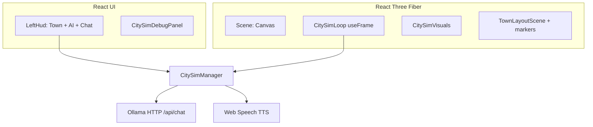

# AI City

**Repository:** [github.com/seed0001/AI-City](https://github.com/seed0001/AI-City)

A browser-based **BurgerPiz** 3D map viewer with a **town simulation** layer: autonomous NPCs, a **marker-based town layout editor** (persisted in the browser), **structured dialogue** (deterministic stubs plus optional **Ollama** LLM completions), **Web Speech** text-to-speech for NPC lines, and a **VRM** resident (Luna) in the world. Rendering uses **React Three Fiber**, PBR lighting, HDRI-style environments, and a custom **night sky** shader.

This document is the project’s primary reference: stack, setup, configuration, how the sim works, and where to change code.

---

## Table of contents

1. [Features at a glance](#features-at-a-glance)
2. [Architecture overview](#architecture-overview)
3. [Tech stack](#tech-stack)
4. [Requirements](#requirements)
5. [Getting started](#getting-started)
6. [npm scripts](#npm-scripts)
7. [Environment variables](#environment-variables)
8. [Ollama (LLM dialogue)](#ollama-llm-dialogue)
9. [Using the app](#using-the-app)
10. [AI and voice settings](#ai-and-voice-settings)
11. [Browser storage (localStorage)](#browser-storage-localstorage)
12. [Simulation systems](#simulation-systems)
13. [Project structure](#project-structure)
14. [Key data flows](#key-data-flows)
15. [Production build and deployment](#production-build-and-deployment)
16. [Troubleshooting](#troubleshooting)
17. [License](#license)

---

## Features at a glance

| Area | What you get |
| ---- | ------------ |
| **3D** | GLB map (`BurgerPiz`) auto-centered; first-person walk with pointer lock; ground, lighting, environment, contact shadows, adaptive DPR |
| **Layout** | Place required/optional **preset markers** (homes, store, park, square), validate, **save** layout, **relaunch** simulation from saved data |
| **Sim** | NPCs spawn at homes, player near square/store; AI decisions, movement, **random conversations** when in range, memory and social state |
| **Dialogue** | Rolling **chat log**; optional **Ollama** for NPC↔NPC ticks and player↔NPC replies; **stub** fallbacks if Ollama is off or errors |
| **TTS** | **Web Speech API** per NPC (optional voice per character, rate/pitch) |
| **Config UI** | **AI & voice** tab: global prompt suffixes, TTS, per-resident persona overrides (stored locally) |
| **Debug** | **City sim** panel: entity snapshot, tick, engine-facing state |

---

## Architecture overview

The UI is a thin **React** shell over a **R3F** `<Canvas>`. A singleton **`CitySimManager`** (via **`CitySimProvider`**) holds entities, locations, memories, the **ConversationSystem**, and a rolling dialogue log. **`CitySimLoop`** runs inside `useFrame` to advance time, the player, NPCs, and conversations. The **town layout** is a separate **React context** with Three.js gizmos for marker placement; saving writes JSON to **localStorage** and can **bootstrap** the sim (`bootstrapFromSavedLayout`).



Ollama is not bundled: the **dev server proxies** `GET/POST` under `/ollama` to `http://127.0.0.1:11434` so the browser does not need CORS on Ollama during development.

---

## Tech stack

| Technology | Role |
| ---------- | ---- |
| **Vite 5** | Dev server, HMR, production build (`target: es2022`, source maps) |
| **React 18** | App shell, context providers, HUD |
| **TypeScript 5.6** | `tsc -b` in build |
| **three r169** | WebGL, tone mapping, shadows |
| **@react-three/fiber 8** | Declarative scene, `useFrame` sim tick |
| **@react-three/drei 9** | Helpers: environment, controls, adaptive DPR, etc. |
| **@pixiv/three-vrm 3** | VRM avatar loading and runtime |
| **leva** | In `package.json` for optional future debug panels (not required by current UI) |

---

## Requirements

- **Node.js** 18+ (recommended for Vite 5 and modern `fetch` / ESM)
- **npm** (or compatible with `package-lock.json`)
- **Optional — Ollama** for real dialogue: install from [ollama.com](https://ollama.com/), run `ollama serve`, pull a model (e.g. `ollama pull llama3.2`)

---

## Getting started

```bash
git clone https://github.com/seed0001/AI-City.git
cd AI-City
npm install
npm run dev
```

Open [http://localhost:5173](http://localhost:5173). The Vite config sets **`server.host: true`**, so you can open the app from another device on the LAN using your machine’s IP and port **5173** (useful for mobile or VR testing).

---

## npm scripts

| Script | Description |
| ------ | ----------- |
| `npm run dev` | Vite dev server (default port **5173**), HMR, `/ollama` proxy |
| `npm run build` | Typecheck (`tsc -b`) then Vite production build to `dist/` |
| `npm run preview` | Serves the production build locally for smoke testing |
| `npm run typecheck` | `tsc -b --noEmit` only (no Vite) |

---

## Environment variables

Vite exposes only variables prefixed with **`VITE_`**. Put them in **`.env`**, **`.env.local`**, or your host’s env (see Vite docs). The repo typically ignores local env files in `.gitignore` — do not commit secrets.

| Variable | Default | Description |
| -------- | ------- | ----------- |
| `VITE_OLLAMA_BASE` | `/ollama` | Base URL or path for Ollama. In dev, `/ollama` is **proxied** to `http://127.0.0.1:11434` (trailing slash stripped in code). For production, set to a **reachable** base (with CORS if the browser calls it cross-origin) or put the app and Ollama behind the same origin. |
| `VITE_OLLAMA_MODEL` | `llama3.2` | Model name passed to Ollama `/api/chat`. Must be pulled locally (`ollama pull …`) or available to your Ollama server. |
| `VITE_OLLAMA_ENABLED` | (enabled) | Set to **`false`** to **disable** Ollama calls entirely; the sim uses **stub** dialogue only (no network to Ollama). |

Implementation: `src/systems/citySim/llm/ollamaConfig.ts` and `src/vite-env.d.ts`.

---

## Ollama (LLM dialogue)

1. Install **Ollama** and start it (usually `ollama serve` is automatic on Windows/macOS when Ollama runs).
2. Pull a model, for example: `ollama pull llama3.2`
3. Run the app with **`npm run dev`**. The browser will call `POST {origin}/ollama/api/chat` which Vite **proxies** to `http://127.0.0.1:11434/api/chat`.

**Production / static hosting:** the Vite **proxy only exists in dev**. You must either:

- Serve the SPA and Ollama under the **same origin** (reverse proxy), or  
- Expose Ollama with **CORS** and set `VITE_OLLAMA_BASE` to the full Ollama URL, or  
- Add your own small backend that forwards chat requests (recommended for public deployments).

**Failure behavior:** If the request fails or Ollama is disabled, the game uses **stub** generators in `stubDialogue.ts` / `conversationStructured.ts` / `conversationPlayer.ts` so the sim still runs.

**JSON format:** The client uses Ollama’s `format: "json"` (see `ollamaClient.ts`) for dialogue ticks so the model is steered toward parseable output; malformed JSON is sanitized or falls back to stubs (`ollamaDialogue.ts`).

---

## Using the app

### Left column (HUD)

Two top tabs (see `LeftHud.tsx`):

- **Town layout** — same behavior as before: mode (layout vs simulation), inventory, place markers, validation, save, relaunch, debug overlay toggles where applicable.
- **AI & voice** — persona, prompt suffixes, TTS (see [AI and voice settings](#ai-and-voice-settings)).

Below: **Town chat** — rolling log of lines, **Stop TTS**, optional player text input (local to the log; as noted in UI, not necessarily wired to the full LLM player path for every flow).

### First-person walk

- **Click** the 3D view to request **pointer lock** (first-person look).
- **W A S D** move; **Shift** for faster movement (see `Scene.tsx` / `WalkControls.tsx` for current speeds and bounds).
- Walk controls use map **bounds** once the GLB is loaded; until then, movement may be limited.

### Layout hotkeys

With a marker **selected** in layout mode, **Delete** or **Backspace** removes the marker, unless focus is in a text field (`TownLayoutEditorPanel`).

### Debug: City sim panel (top-right)

`CitySimDebugPanel` shows a JSON-ish snapshot: entities, timing, and other engine-facing data useful when tuning behavior or verifying the loop.

---

## AI and voice settings

Open **Left column → AI & voice**. Settings are persisted under **`ai-city-sim-settings`** in `localStorage` (`src/systems/citySim/settings/aiSimSettings.ts`).

| Category | What it does |
| -------- | ------------ |
| **Global system suffixes** | Text appended to the **NPC↔NPC** and **Player↔NPC** system prompts in `ollamaDialogue.ts` (town tone, safety, style). |
| **TTS** | Master on/off, **rate** and **pitch**; uses **Web Speech API** (`characterSpeech.ts`). |
| **Per character** (each NPC seed + the human resident) | Optional overrides: display name, role, mood, traits (comma-separated), long-form **persona / voice notes** for the model, and a fixed **TTS voice** (dropdown from the browser’s voice list). **Auto** TTS mode keeps the old stable hash-by-id choice. |
| **Reset** | Per-character or full reset to **defaults** in storage. |

**Important:** These overrides primarily affect **LLM scene JSON** and **TTS**. They do not automatically rename entities in the **3D labels** or internal engine unless you add a sync from settings into `TownEntity` in the future.

Moods accepted for overrides: `calm` | `annoyed` | `friendly` | `nervous` | `angry` (invalid text falls back to the live entity mood).

---

## Browser storage (localStorage)

| Key | Purpose | Typical module |
| --- | ------- | -------------- |
| `ai-city-town-layout-v1` | Saved marker layout (version 1) | `townLayout/storage.ts` |
| `ai-city-sim-settings` | AI persona, prompt suffixes, TTS | `settings/aiSimSettings.ts` |

Do not rely on these keys for security; any script on the origin can read or overwrite them.

---

## Simulation systems

High-level (see `src/systems/citySim/`):

| System / module | Role |
| --------------- | ---- |
| **`CitySimManager`** | Owns `EntityRegistry`, `MemorySystem`, `LocationRegistry`, `ConversationSystem`, `dialogueLog`, `simulationEnabled`; `tick()` each frame. |
| **`EntityRegistry`** | All `TownEntity` instances; look up by id. |
| **`LocationRegistry`** | City locations from marker layout (`markerToLocations.ts`). |
| **`MovementSystem`** | Move entities toward destinations. |
| **`DecisionSystem`** | Schedules AI decisions, goals, walk targets. |
| **`PerceptionSystem` / `TALK_RADIUS`** | Who is near whom (`constants.ts`: e.g. `TALK_RADIUS = 4`, `PERCEPTION_RADIUS = 12`). |
| **`SocialSystem` / `MemorySystem`** | Relationship and rolling memory events feeding LLM/prompt packets. |
| **`ConversationSystem`** | Starts and ticks conversations, calls LLM or stubs, emits dialogue lines. |
| **`ollamaDialogue` + `ollamaClient`** | HTTP chat to Ollama, structured JSON for exchanges. |
| **`PromptBuilder` / `worldContext`** | LLM-safe world context (no `controllerType` in prompts; see `types.ts` comment). |
| **Speech** | `characterSpeech.ts` for TTS on AI lines. |

**NPC list** and seeds: `data/townCharacters.ts` (`CHARACTER_SEEDS` — e.g. Bob, Sarah, Luna, Adam; human `HUMAN_ENTITY_ID`).

**Preset markers** and required/optional rules: `data/presetMarkers.ts` (e.g. `store_main`, `square_main`, `home_bob`, …). Relaunch checks that **required** markers are placed.

---

## Project structure

```
AI-City/
├── public/
│   └── models/
│       ├── BurgerPiz.glb          # Main map
│       └── npc/
│           └── Luna.vrm           # VRM NPC
├── src/
│   ├── scene/                     # Canvas, map load, walk, lighting, ground, night sky, environment
│   │   ├── Scene.tsx
│   │   ├── BurgerPizModel.tsx
│   │   ├── WalkControls.tsx, WalkSpawn.tsx
│   │   ├── nightSkyShader.ts, NightSky.tsx
│   │   └── …
│   ├── systems/citySim/
│   │   ├── CitySimManager.ts      # Sim orchestration
│   │   ├── CitySimContext.tsx
│   │   ├── ConversationSystem.ts, DecisionSystem.ts, …
│   │   ├── data/
│   │   │   ├── townCharacters.ts  # Character seeds
│   │   │   └── presetMarkers.ts   # Marker definitions
│   │   ├── llm/
│   │   │   ├── ollamaClient.ts
│   │   │   ├── ollamaDialogue.ts
│   │   │   └── ollamaConfig.ts
│   │   ├── settings/
│   │   │   └── aiSimSettings.ts
│   │   ├── speech/
│   │   │   └── characterSpeech.ts
│   │   ├── townLayout/            # Layout context, save/load, 3D placement
│   │   └── components/
│   │       ├── LeftHud.tsx
│   │       ├── AiSettingsPanel.tsx
│   │       ├── DialogueChatPanel.tsx
│   │       ├── CitySimLoop.tsx, CitySimVisuals.tsx
│   │       └── …
│   ├── App.tsx
│   ├── main.tsx
│   ├── index.css
│   └── vite-env.d.ts
├── vite.config.ts                 # port 5173, host, /ollama proxy, asset types
├── index.html
├── package.json
└── README.md
```

**Main tuning numbers** (prototype defaults) live in `constants.ts`, for example: `TALK_RADIUS`, `PERCEPTION_RADIUS`, `ENTITY_Y`, `CONVERSATION_COOLDOWN_MS`, decision and conversation interval ranges.

---

## Key data flows

### 1) Layout save → simulation boot

1. User saves layout in **Town layout**; JSON written to `localStorage`.  
2. **Relaunch** calls `CitySimManager.bootstrapFromSavedLayout`, which builds `CityLocation[]`, spawns NPCs at home markers, places the human at square/store, enables `simulationEnabled`.

### 2) Sim tick (every frame)

1. `CitySimLoop` updates **human** position from walk controls, NPC movement, **conversation** ticks, random **encounter** checks, and **AI decisions** (`CitySimManager.tick`).

### 3) Optional dialogue (Ollama)

1. `ConversationSystem` builds **scene packets** (`conversationStructured.ts` / `conversationPlayer.ts`) from entities + memory + relationship state.  
2. User settings merge via `getMergedAgentSlice` in `aiSimSettings.ts` (name, role, mood, traits, `personaNotes`).  
3. `fetchNpcNpcExchange` / `fetchPlayerNpcReply` in `ollamaDialogue.ts` add **system suffixes** and call `ollamaChat`.  
4. On success, structured results apply to entities and **memory**; new lines go to `appendDialogueLine` → log + TTS (if enabled).

### 4) TTS

`appendDialogueLine` in `CitySimManager` calls `speakAiLine` for non-player speakers when TTS is enabled, using the voice pool or per-character `voiceUri`.

---

## Production build and deployment

```bash
npm run build
npm run preview
```

- Output: **`dist/`** — static files; host with any static file server (or SPA fallback to `index.html` for client routing if you add routes later).  
- **Ollama** will **not** be proxied: configure `VITE_OLLAMA_BASE` at build time to point at your deployed API or same-origin path. Rebuild when changing `VITE_*` vars (they are inlined at build).  
- **CORS / security:** Never expose an unsecured Ollama instance to the public internet without authentication and rate limits; treat `VITE_*` as **public** (anyone can read them from the client bundle).

---

## Troubleshooting

| Symptom | Things to check |
| ------- | ----------------- |
| **No Ollama responses** | Is Ollama running? Model pulled? `VITE_OLLAMA_ENABLED` not `false`? In dev, does `http://127.0.0.1:11434` respond? Check browser **Network** tab for `/ollama/api/chat` status and body. |
| **CORS errors in production** | Dev proxy only; set `VITE_OLLAMA_BASE` to a same-origin or CORS-allowed URL, or add a server-side proxy. |
| **No voices / bad TTS** | Web Speech is browser-specific; try **Edge** on Windows for richer “Microsoft / Natural” voices. macOS `say` is not used — only browser voices. |
| **Layout save missing** | Private / incognito might clear storage; different origin (file vs `localhost`) uses different `localStorage`. |
| **Stub dialogue only** | Ollama disabled, model missing, or JSON parse / HTTP errors; see console for `[ollama]` warnings. |
| **Performance** | Lower DPR, reduce map complexity, or profile R3F (`PerformanceMonitor` is already in the scene). |

---

## License

`package.json` marks the project as **`"private": true`**. It is a personal / team repository unless you add an explicit `LICENSE` file and change that field for open source.

If you open-source the repo, replace this section with your chosen **SPDX** license and update any third-party attribution for **BurgerPiz** assets, HDRI, or fonts on the hosting site.

---

## Further reading in-repo

- **`types.ts`** — `TownEntity`, moods, `ConversationState`, and the rule that **engine-only** fields (e.g. `controllerType`) do not go to LLM prompts.  
- **`ollamaDialogue.ts`** — Exact `NPC_SYSTEM` and `PLAYER_SYSTEM` strings and JSON expectations.  
- **`townLayout/validation.ts`** — What makes a layout “valid” to relaunch.

For questions or contributions, use the [GitHub repository](https://github.com/seed0001/AI-City) issues and pull requests when available.
