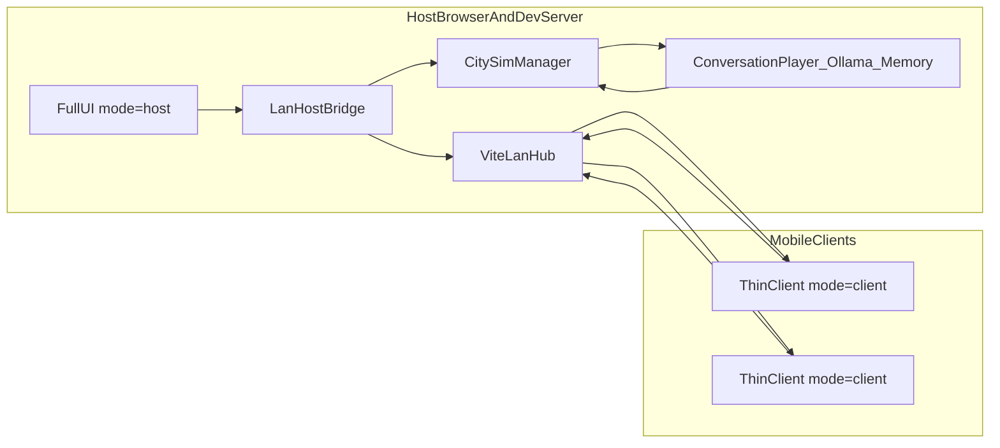

# LAN shared world + mobile thin client

This document explains the host-authoritative LAN mode:

- one shared world
- one host AI/memory pipeline
- mobile-friendly thin clients (movement + chat only)

## What is authoritative

In LAN mode, the host machine owns:

- `CitySimManager` runtime state
- `ConversationSystem` and social updates
- `MemorySystem` short/episodic/long-term layers
- all Ollama calls and fallbacks

Thin clients do **not** call Ollama and do not run a separate AI simulation. They send player commands and receive snapshots.

## Runtime topology

## Key files

- LAN websocket hub (Vite dev server): `vite-plugin-lan-hub.ts`
- Vite plugin registration: `vite.config.ts`
- Host bridge/runtime wrapper: `src/systems/citySim/network/LanHostBridge.tsx`
- Protocol contracts: `src/systems/citySim/network/protocol.ts`
- Thin mobile client: `src/mobile/ThinClientApp.tsx`
- App mode switch: `src/App.tsx`
- Host chat execution path: `src/systems/citySim/CitySimManager.ts`

## URL modes

- Full UI (existing behavior): `http://<host-ip>:5173/`
- Host authoritative LAN mode: `http://<host-ip>:5173/?mode=host`
- Thin client mode: `http://<host-ip>:5173/?mode=client&host=<host-ip>:5173`
- Thin client low-power render profile: append `&quality=low`

## Message flow (single shared world)

1. Client connects to `/lan` and registers as `role=client`.
2. Host connects and registers as `role=host`.
3. Client sends:
   - `clientPose` (position/rotation and movement intent)
   - `clientChat` (text)
4. Hub forwards client messages to host.
5. Host bridge applies pose/chat to host `CitySimManager`.
6. Host sends `hostSnapshot` at fixed cadence.
7. Hub broadcasts snapshots to all clients.

## Mobile UI behavior

Thin client ships a touch-first UI:

- left virtual joystick for movement
- sprint button
- right drag zone for look
- compact top status bar
- bottom chat sheet (scroll + input)
- safe-area-aware placement for notched devices

No layout editor, AI settings panel, or debug panel is shown in thin mode.

## Performance and resilience

- Snapshot cadence: host bridge sends on interval (100ms default).
- Mobile render defaults:
  - reduced DPR range in thin mode
  - optional `quality=low` for lower power/network pressure
- Input and chat sanitization:
  - host clamps incoming pose values
  - host trims chat length before processing
- Reconnect:
  - thin client auto-retries on websocket close/error

## LLM and memory guarantees

- All `submitPlayerChat(...)` work runs on host side.
- Host executes `buildPlayerNpcScenePacket -> fetchPlayerNpcReply/generateStub -> applyPlayerNpcReply`.
- Memory writes remain centralized in host `MemorySystem`.
- Every client sees the same world consequences through broadcast snapshots and shared chat log.

## LAN checklist

1. On host machine, run:
   - `npm install`
   - `npm run dev`
2. Ensure firewall allows inbound connections to port `5173`.
3. Open host tab with `?mode=host`.
4. Share thin client URL with mobile users.
5. Keep host tab open (it is the authoritative runtime).

If the host tab closes, clients can reconnect, but world authority and AI progression stop until host mode returns.

